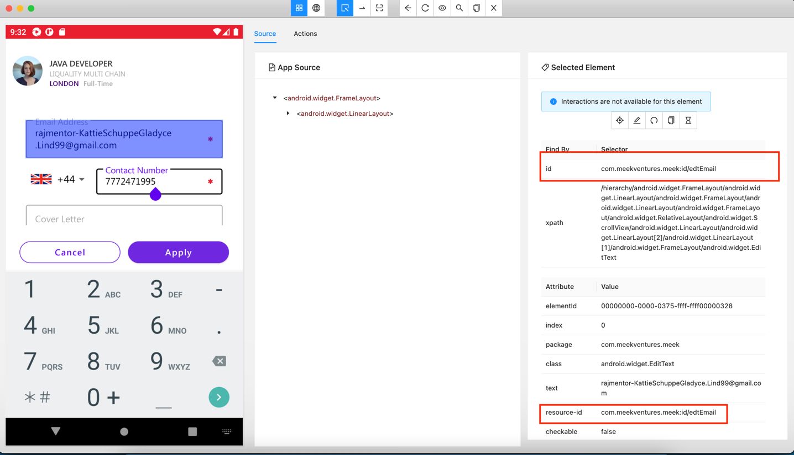
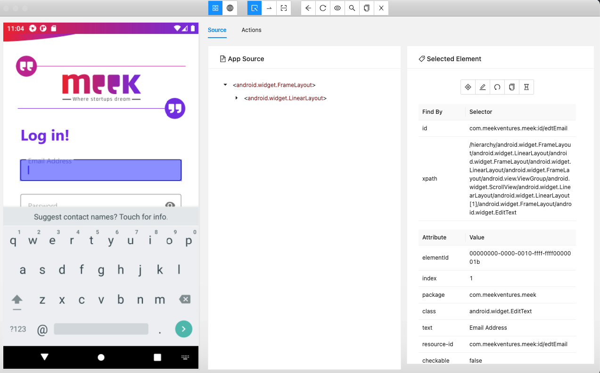
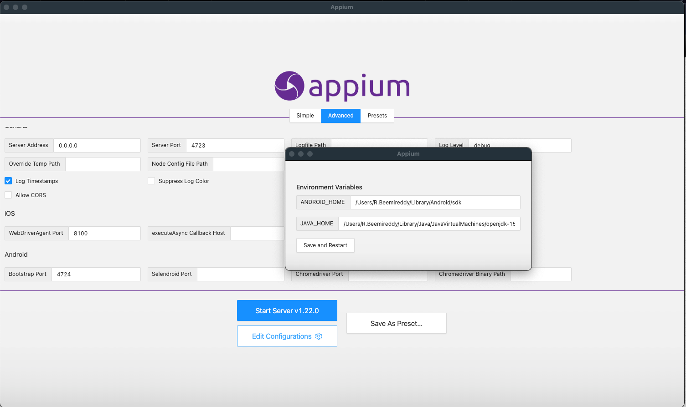

# Android-appium-tests

## :gear: Run tests

```shell
gradle clean test
```

```shell
allure generate build/allure-results
```

```shell
./gradlew allureServe
```

# :gear: Inspect elements of the app





# :gear: Check appium settings



## :e-mail: Contacts
Owner: [beemi.raja@gmail.com](beemi.raja@gmail.com)